# EdX DEV212x Intro to DevOps - LAB 4 #
This is the Hands on Lab for module 4 of the Intro to DevOps course.

## LAB 4 - Release Management with Visual Studio Team Services ##
Once you have completed the videos and other course material for Module 4, you can continue with this lab.

In this lab you have an application called PartsUnlimited, committed to a Git repo
in Visual Studio Team Services (VSTS) and a Continuous Integration build that builds the app and
runs unit tests whenever code is pushed to the master branch. Please refer to the
[LAB 3](../Lab3/EdX212x-Lab3.md) in order to see how the CI build was set up.
Now you want to set up Release Management (a feature of Visual Studio Team Services)
to be able continuously deploy the application to an Azure Web App. Initially the
app will be deployed to a `dev` deployment slot. The `staging` slot will require and
approver before the app is deployed into it. Once an approver approves the `staging` slot,
the app will be deployed to the production site.

## Pre-requisites:

* You have completed [LAB 1](../Lab3/EdX212x-Lab1.md)
* You have completed [LAB 3](../Lab3/EdX212x-Lab3.md)

* An active Azure account to host the PartsUnlimited Website as a Web App
> **Note**: In order to use deployment slots, you'll need to configure the Web App to use Standard or Premium App Service Plan mode. You **cannot** create
deployment slots for Basic or Free Azure Web Apps. To learn more about deployment slots, see [this article](https://azure.microsoft.com/en-us/documentation/articles/web-sites-staged-publishing/).

* An organizational account that is a co-administrator on your Azure account
> **Note**: This is required because deploying [ARM Templates](https://azure.microsoft.com/en-us/documentation/articles/resource-group-authoring-templates/)
to Azure requires an organizational account or a [Service Principal](http://blogs.msdn.com/b/visualstudioalm/archive/2015/10/04/automating-azure-resource-group-deployment-using-a-service-principal-in-visual-studio-online-build-release-management.aspx).
MSA Account and certificate-based connections are not supported. For this HOL, you will use an organizational account.

## Tasks Overview:

**1. Complete [LAB 3](../Lab3/EdX212x-Lab3.md).**
This will walk through creating a Visual Studio Team Services account, committing the PartsUnlimited source code
and setting up the Continuous Integration (CI) build.

**2. Modify the CI Build to include ARM Templates**
The source code already defines the infrastructure required by the application in code (Infrastructure as Code). The
code is a json file based on the Azure Resource Manager (ARM) template schema. You will use the template to deploy
or update the infrastructure as part of the release.

**3. Create a Service Endpoint in Visual Studio Team Services to an Azure Account.**
In this step you'll download your Azure publish settings file and create Service Endpoint in Visual Studio Team Services for
your Azure account. This will enable you to configure deployment of the PartsUnlimited Website to Azure as an Azure
Web Application from Builds or Releases.

**4. Create a Release Pipeline for the Parts Unlimited Website.**
In this step, you will create a Release definition for the PartsUnlimited Website. You'll use the CI build output
as the input artefact for the Release and then define how the release moves through `environments` with approvals
in between.

**5. Trigger a Release.**
Once the Release Definition is set up, you will trigger a release and see the pipeline in action.

# Hands On Lab
### 1: Complete HOL - Parts Unlimited Website Continuous Integration with Visual Studio Team Services
Make sure you've completed [LAB 3](../Lab3/EdX212x-Lab3.md).

### 2: Modify the CI Build to include the ARM Templates
In order to deploy to Azure, you're going to to specify the infrastructure that the PartsUnlimited Website requires. For example,
the site requires an Azure SQL Database and an Azure Web App. Rather than create these by hand, you are going to use the Azure
Resource Manager (ARM) templates that describe this infrastructure in a json file. This is good practice, since you're
describing infrastructure as code.

The task that will deploy the ARM template will create the resource group if it does not exist. If the resource group does
exist, then the template is used to update the existing resources.

> **Note:** The infrastructure described in the ARM templates for this HOL will create resources that are not free.
It creates an Azure Web App with 3 deployment slots. Deployment slots are only available on Standard or Premium App Service Plans.
They are **not** available on Free or Basic plans. Once you've completed this lab, you probably want to delete the resource
group in order to minimize charges to your Azure account.

1. Log into your VSTS account and click on the BUILD hub.
2. Click the HOL Build that you configured in the Continuous Integration HOL, and click "Edit".
3. Click the "Visual Studio Build" task and modify the **MSBuild** parameters as follows:
    ```script
    /p:DeployOnBuild=true   
    /p:WebPublishMethod=Package     
    /p:PackageAsSingleFile=true     
    /p:SkipInvalidConfigurations=true     
    /p:PackageLocation="$(build.stagingDirectory)"
    ```
    
    
4. Click the "Copy and Publish Build Artifacts" task and update it to look as follows:

	
	* This constrains the `drop` folder to contain only the WebDeploy zip file, which is a package containing
	the website.
5. Click "+ Add build step..." and add a new "Publish Build Artifacts" task. Configure it as follows:

	
	* For `Path to Publish`, click the "..." button and browse to the PartsUnlimitedEnv/Templates folder
	* For `Artifact Name`, enter "ARMTemplates"
	* For `Artifact Type`, select "Server" 
6. Queue a new build by clicking the "Queue build" button. Accept the defaults and click OK.
7. When the build has completed, verify that there are 2 folders: drop and ARMTemplates.
	* The drop folder should contain a single file: PartsUnlimitedWebsite.zip (click "Explore" to view the contents)
	* The ARMTemplates folder should contain a number of json files.

### 3: Create a Service Link from Visual Studio Team Services to an Azure Account
In order to interact with Azure, you'll need to create a Service Endpoint in VSTS. This Endpoint includes the
authentication information required to deploy to Azure.

> **Note**: Deploying [ARM Templates](https://azure.microsoft.com/en-us/documentation/articles/resource-group-authoring-templates/)
to Azure from Release Management requires an organizational account or a [Service Principal](http://blogs.msdn.com/b/visualstudioalm/archive/2015/10/04/automating-azure-resource-group-deployment-using-a-service-principal-in-visual-studio-online-build-release-management.aspx).
MSA Accounts and certificate-based connections are not supported. For this HOL, you will use an organizational account, but you can 
create a Service Principal if you wish to.

1. Create an organizational account in Azure
	* Create a user in the Azure Active Directory from the old Azure portal (https://manage.windowsazure.com). If you do not have
	a custom domain, then use the `onmicrosoft.com` domain (the default domain). The user should be something like `testuser@myazure.onmicrosoft.com`
	* After adding the account, the following two things need to be done to use the account during a VSTS release:
		* Add the Active Directory account to the co-administrators in the subscription. Go to the Settings hub (click on the Gear
		icon in the left-hand main menu) and then click on administrators and add the account as a co-admin.
		* Login to the portal with this Active Directory account (e.g. `testuser@myazure.onmicrosoft.com`, and change the password.
		Initially a temporary password is created and that needs to be changed at the first login.

2. Create an Azure Service Endpoint in Visual Studio Team Services
	* Log in to your VSTS account.
	* Open the project administration page by clicking the gear icon in the upper right.
	
		
	* Click on the Services tab
	
		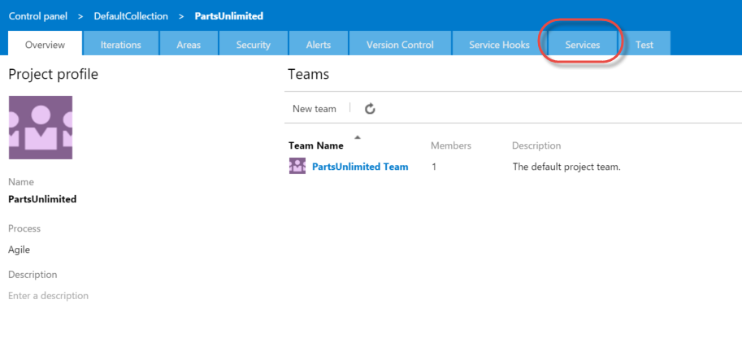
	* Click on "New Service Endpoint" and select Azure from the list
	
		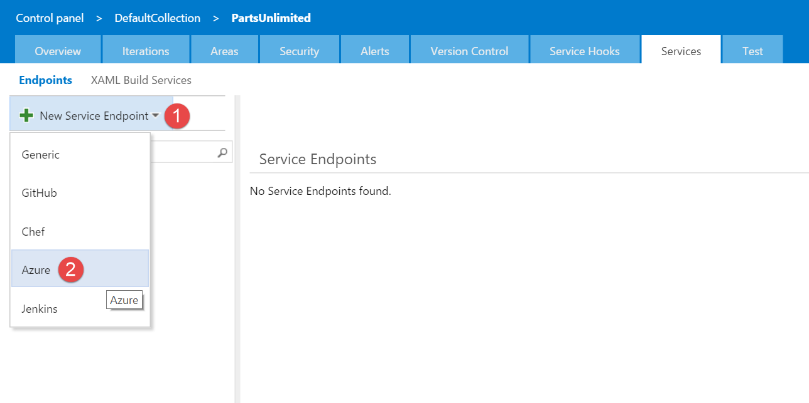
	* Click on the "Credentials" radio button
		* Enter any name for the Connection Name - this is to identify this Service Endpoint in VSTS.
		* Copy the Subscription Id and Subscription Name for your Azure subscription. You can get this
		by logging into the new Azure portal and clicking "Subscriptions".

		
		
		* Enter the username and password of the user you created in the previous Task. Click OK.
	
		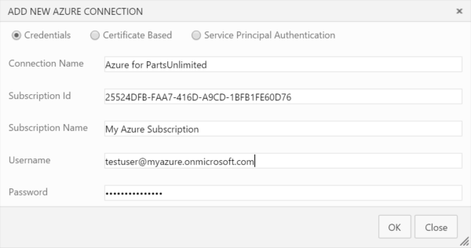
	* You should see a new Service Endpoint. You can close the project administration page.
	
	
    
    * Repeat the above steps to create a "New Service Endpoint" but select the "Certificate" radio button
 

### 4: Create a Release Definition
Now that you have an Azure Service Endpoint to deploy to, and a package to deploy (from your CI build),
you can create a Release Definition. The Release Definition defines how your application moves through
various Environments, including Tasks to update infrastructure, deploy your application, run scripts and
run tests. You can also configure incoming or outgoing approvals for each Environment.

An Environment is simply a logical grouping of tasks - it may or may not correspond to a set of machines.
For this Release Definition, you will create 3 Environments: Dev, Staging and Production.

The infrastructure required for all 3 environments is described in an ARM Template. The ARM Template will
be invoked during the deployment in the Dev Environment before deploying the website to Dev. It will not
be necessary to run any infrastructure tasks during Staging or Production deployments in this case. 

1. Create a Release Definition to Deploy Infrastructure and Deploy to Dev
	* In VSTS, click on the Release hub
	* Click on the green + button at the top of the left hand menu to create a new definition. This will
	launch a wizard prompting you to select a deployment template. Click on "Empty" to start with an empty
	release and click OK.
	
	
	* The template has created a single Environment (called Default Environment).
	* Enter "PartsUnlimited" into the name field at the top to name this Release Definition.
	* Before completing the "Azure Web App Deployment" task, you'll need to configure the source package. Click on 
	the "Artifacts" link.
	
	
	* Click the "Link to a build definition" link.
	
	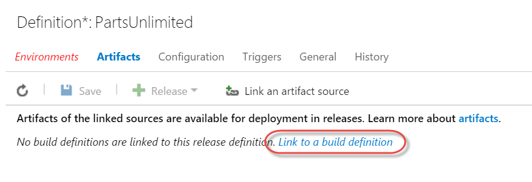
	* You'll now link this Release Definition to the CI build. Select the Project and Build from the drop downs and click Link.
	
	
	> **Note:** It is possible to Link other package sources, but you only need the CI build for this Release.
	
	* Click on the Environments link to go back to the Environments page. 
	
	* Click the name label on the Default Environment card and change the name to "Dev".
	
		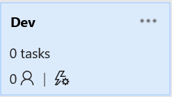
	
	* Click on the "+ Add tasks" button to add a task for this environment. In the "Deploy" group, click the "Add"
	button next to "Azure Resource Group Deployment" to add the task. Close the "ADD TASKS" dialog.
	
		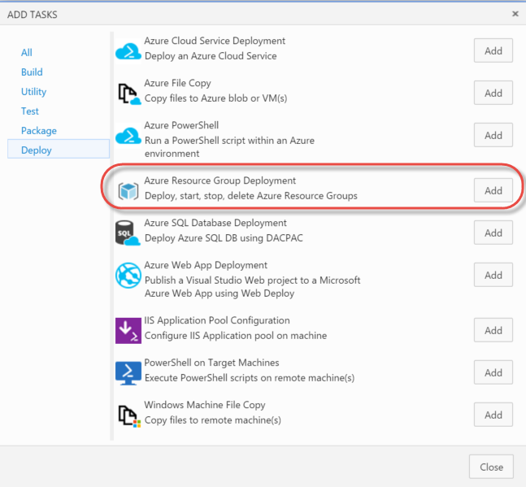
		
	* Click on the "Azure Resource Group Deployment" task. Configure it as follows:
		* `Azure Subscription`: select the Azure subscription endpoint that you created in Task 2
		* `Action`: select "Create or Update Resource Group"
		* `Resource Group`: enter a name for your resource group. This must be unique in your Azure
		subscription.
		* `Location`: select an Azure location
		* `Template`: click the "..." button and browse to the FullEnvironmentSetupMerged.json file in the ARMTemplates
		folder.
		
		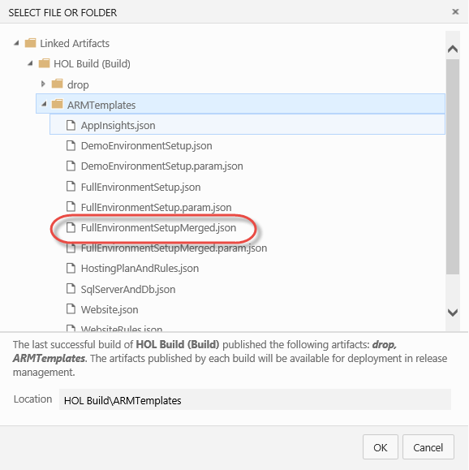
		* `Template Parameters`: click the "..." button and browse to the FullEnvironmentSetupMerged.param.json file
		in the ARMTemplates folder.
		* `Override Template Parameters`: Enter the following in a single line (shown split here for convenience):
		```powershell
		-WebsiteName $(WebsiteName) 
		-PartsUnlimitedServerName $(ServerName)  
		-PartsUnlimitedHostingPlanName $(HostingPlan) 
		-CdnStorageAccountName $(StorageAccountName) 
		-CdnStorageContainerName $(ContainerName) 
		-CdnStorageAccountNameForDev $(StorageAccountName)-dev 
		-CdnStorageContainerNameForDev $(ContainerName)-dev
		-CdnStorageAccountNameForStaging $(StorageAccountName)-stage 
		-CdnStorageContainerNameForStaging $(ContainerName)-stage 
		-PartsUnlimitedServerAdminLoginPassword (ConvertTo-SecureString '$(AdminPassword)' -AsPlainText -Force) 
		-PartsUnlimitedServerAdminLoginPasswordForTest (ConvertTo-SecureString '$(AdminTestPassword)' -AsPlainText -Force)
		```
		You will shortly define the values for each parameter, like `$(ServerName)`, in the Environment variables.
		
		> **Note**: If you open the FullEnvironmentSetupMerged.param.json file, you will see empty placeholders for these parameters.
		> You could hard code values in the file instead of specifying them as "overrides". Either way is valid. If you do specify
		> values in the params file, remember that in order to change values, you would have to edit the file, commit and create a 
		> new build in order for the Release to have access the new values.
		
		* Make sure the `Output -> Resource Group` parameter is empty. It is not required for this release.
	
	* Click on the ellipsis (...) button next to the Environment and select "Configure variables..."

		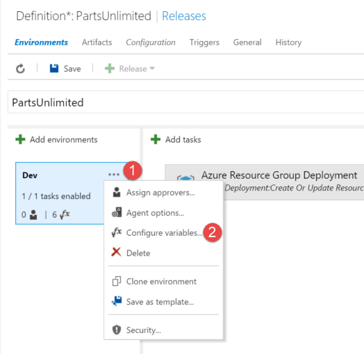

	* Create the following variables, adding values too.
		* **WebsiteName** - Name of the website in Azure
		* **ServerName** - Prefix for the name of the database servers. Will have `-dev` or `-stage` added for dev/staging
		* **HostingPlan** - Name of the hosting plan for the website
		* **StorageAccountName** - Storage account name prefix. Will have `-dev` or `-stage` added for dev/staging
		* **ContainerName** - Container name prefix. Will have `-dev` or `-stage` added for dev/staging
		* **AdminPassword** - Admin password for production database server
		* **AdminTestPassword** - Admin password for dev and staging database servers

		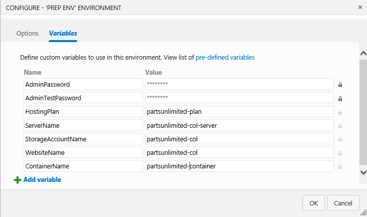
		> **Note**: You can hide passwords and other sensitive fields by clicking the padlock icon to the right of the value text box.

		* Save the definition.

1. Test the ARM Template Deployment

	Before moving on, it is a good idea to test the template so far.
	
	* Click on "+ Release" in the toolbar and select "Create Release" to start a new release.

	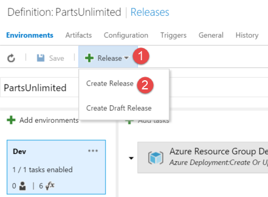
	
	* Select the latest build from the drop-down, and then select "Dev" as the target environment.
	Click "Create" to start the release.

	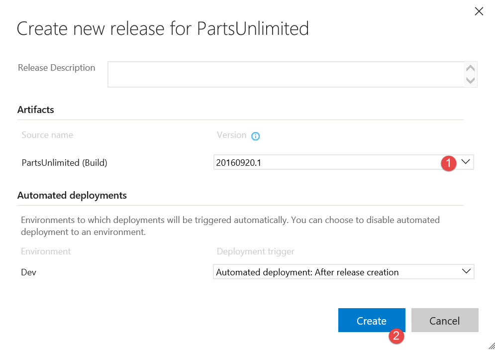
	
	* Click the "Release-x" link to open the release.

	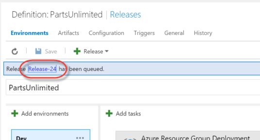
	
	* Click on the Logs link to open and monitor the deployment logs.
	
	* You should see a successful release after a few minutes.

	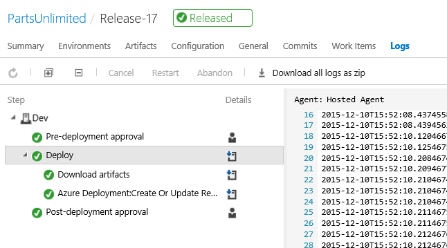
	* If you log into the Azure Portal, you will see the Resource Group has been created.

	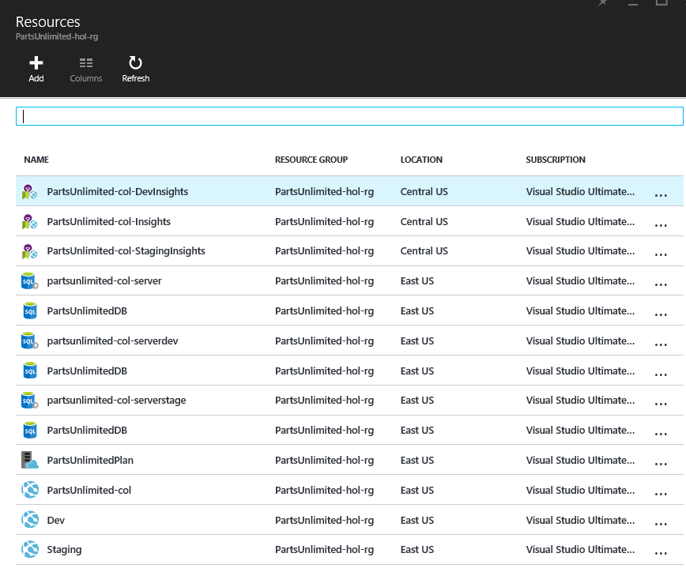
	
1. Add Web Deployment Tasks to Deploy the Web App

	Now that the infrastructure deployment is configured, you can add a task to deploy the web app to Dev.
		
	* Click on the Dev environtment in the Release Definition. Then click "+ Add tasks".
	* Select the "Deploy" group in the left and click the add button next to "Azure Web App Deployment" to add the task.
Close the task selector dialog.
	* Click on the "Azure Web App Deployment" Task.
		* Select the Azure Service Endpoint you created earlier in the Azure Subscription drop down.
		* For Web App Name, enter the `$(WebsiteName)` to use a variable. You defined this variable earlier when deploying
		the ARM Template. You will shortly "promote" it to a Release variable so that it can be used in all Environments in the Release.
		* Select the same Azure region for your Web App that you selected in the "Azure Resource Group Deployment" task.
		* Enter "dev" for the Slot. This will deploy the site to the "dev" deployment slot. This allows you
		to deploy the site to an Azure deployment slot without affecting the Production site.
		* Click the ellipsis (...) button to set the Web Deploy Package location. Browse to the PartsUnlimitedWebsite.zip file and click OK.
	
		
		* Clear the "Additional Arguments" parameter. The ARM template you deployed has already configured all the slot-specific
		app settings and connection strings.
		* The Task should look like this:
	
		
	> **Note**: It is a good practice to run smoke tests to validate the website after deployment, or to run load tests. The code-base you are using
	does not have any such tests defined. You can also run quick cloud-performance tests to validate that the site is up and running. For more 
	information on quick load tests, see [this video](https://channel9.msdn.com/Events/Visual-Studio/Connect-event-2015/Cloud-Loading-Testing-in-Visual-Studio-Team-Service)
	from around the 6 minute mark. 
	
	* Promote the WebSite Environment variable to a Release Variable
		* Click on the "Dev" environment, click the ellipsis (...) button select "Configure Variables".
		* Make a note of the `WebsiteName` variable value and delete it from this list. Click OK.
		* Click on "Configuration" to open the Release variables. These are "global" variables that any Environment can use.
		* Enter "WebsiteName" for the name and enter the value for the Website in Azure.

		
		
	* Click Save to save the Release Definition.

1. Test the Dev Environment

	You will shortly clone the Dev Environment into both Staging and Prod environments. However, before you do that
	it's a good idea to test that the Dev Environment is correctly configured by creating a new Release.

	* Click on the "+ Release" button and select Create Release.
	
	
	* You can enter a Release Description if you want to.
	* Select the latest build from the HOL Build drop down.
	* Click on the Dev Environment to set it as the target environment for this Release. Click Create.
	* Click the Release link to open the Release.
	
	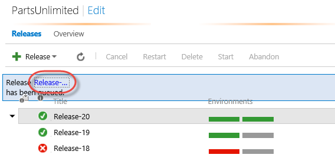
	* Click on the Logs link to open the deployment logs.
	* Once the deployment completes, you can check that the site was in fact deployed successfully by navigating to the
	site url.
	> Since you deployed to the dev slot, you will need to navigate to `http://{siteName}-dev.azurewebsites.net` where siteName 
	is the name of your Web App in Azure.
	
	
	* You will also have received an email confirmation that the Release to the Dev environment completed successfully. This
	is because you are the owner of the Dev environment.
		
1. Clone the Dev environment to Staging and Production

	Now that you have verified that the Dev Environment is configured correctly, you can clone it to Staging and Production.
	
	* Click on the PartsUnlimited link and then the Edit link to open the Release Definition.
	> **Note:** It is possible to change the definition for a Release without changing the Release Definition (i.e. the Release is an instance of the Release Definition that you can edit). You want to make sure that you are editing the Release Definition, not a Release.
	
	* Click the ellipsis (...) on the Dev Environment card and select "Clone environment".
	
	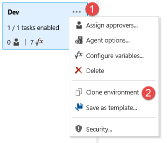
	* A new Environment is created. Enter "Staging" for the name.
	* Delete the "Azure Resource Group Deployment" task. This is not required in this Environment since the ARM template deployed
	the infrastructure for all 3 environments.
	* Click the ellipsis (...) on the Staging Environment card and select "Configure variables".
	* Delete all the variables. These are used by the "Azure Resource Group Deployment" task which you just deleted, so they are not
	necessary in this Environment.
	* On the Azure Web App Deployment task, set the Slot to `staging`.
	
	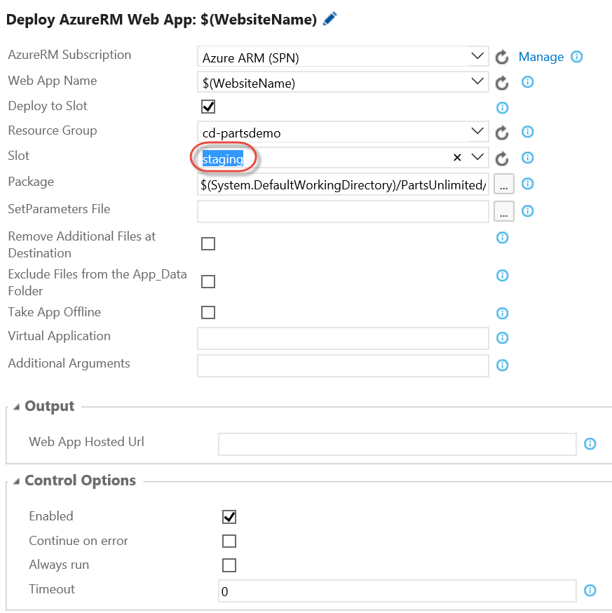
	
	> **Note**: If you had environment-specific variables, you would be able to set Staging-specific values. It is not necessary in this case.
	
	* In the Dev Environment, you did not define any approvers. For Staging, however, you should
	configure approvers. For this HOL, you can be both incoming and the outgoing approver.
	> **Pre-deployment approvers** must approve a deployment coming _into_ the environment. The deployment will stop and wait
	before executing any tasks in the environment until approval is granted.<br/>
	**Post-deployment approvers** approve deployments so that the _next_ Environment can begin. They act as sign-off
	for the current environment.<br/>
	**Approvers** can be individuals or groups.
	
	* In this case, you want to pause the deployment coming in. This ensures that if someone is testing in the Staging environment,
	they don't suddenly get a new build unexpectedly.
	* Configure approvers for the Staging environment
	
	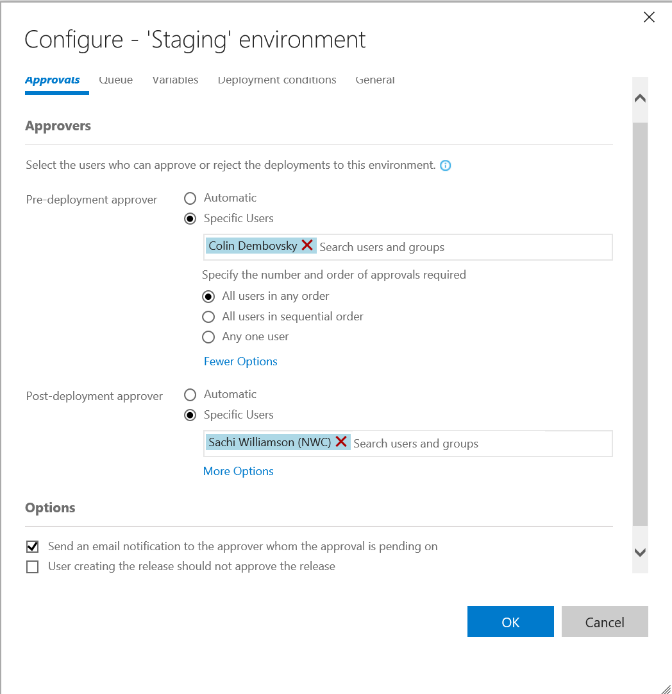
	
	* Save the Release Definition.

	* Clone the Staging environment to Production.
		* Update the Slot parameter to be empty (i.e. the site will deploy to the production slot)
		* Update the approvers - again, you can be both approvers.
	
	* Save the Release Definition.
	
	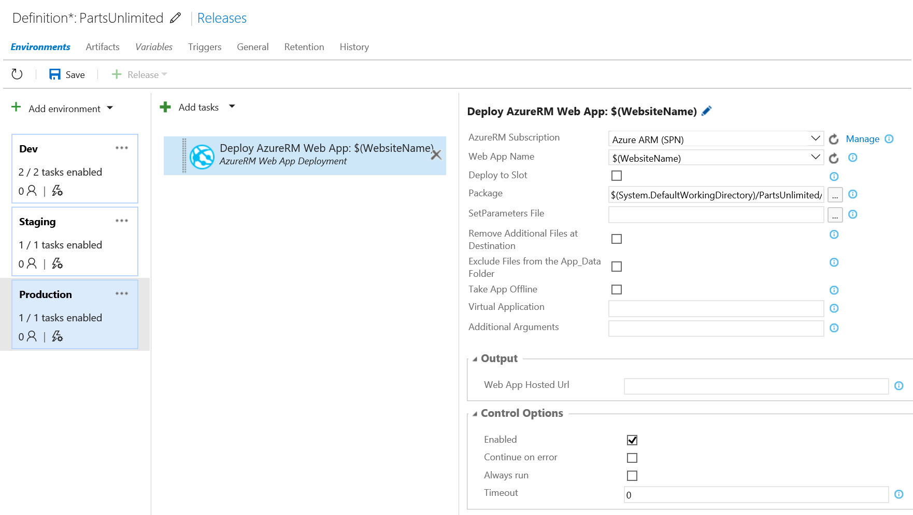
	
1. Configure Continuous Deployment for this Release Definition
	* Click on the Triggers link of the Release Definition.
	* Check the "Continuous Deployment" check box.
	* Set the Source Label and Target environment.
	> Selecting the build as the trigger means that any time the artifact build
	completes, a new release will automatically start using the latest build.
	
	
	
	> **Note:** Since the incoming build for this release is a CI build, you probably
	don't want to deploy the build all the way to Production. Setting the Release to
	stop at Dev means that you will need to create a new Release with Production as 
	the target environment if you want to deploy to Production. This is of course 
	configurable according to your own preference.

### 5: Create a Release
Now that you have configured the Release Pipeline, you are ready to trigger a complete
release.
	
* Click on "+ Release" to create a new Release.
* Select the latest build, set Production as the target Environment and click Create.

	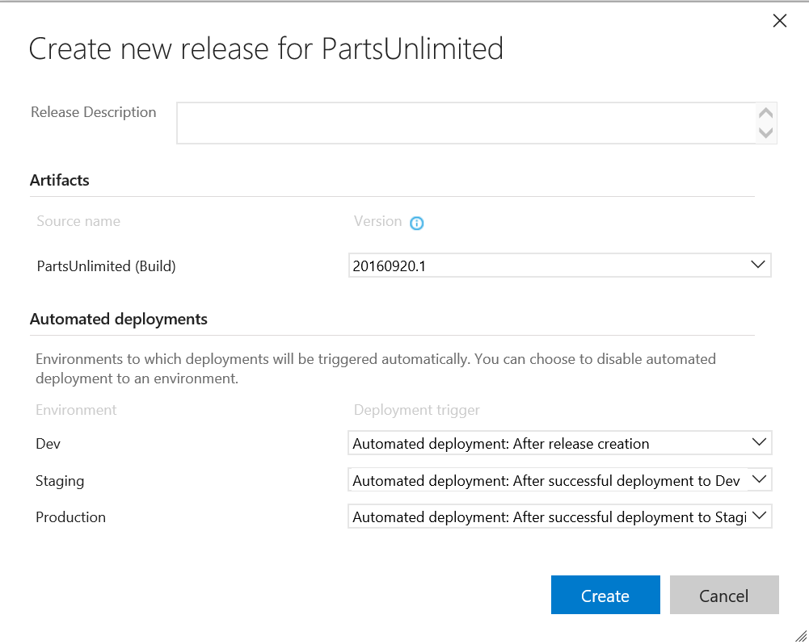
	
* Once the Dev stage has completed deployment, you will see a notification that
an approval is pending (you will also have received an email to this effect).
Check the dev slot of the PartsUnlimited site in Azure to ensure that the Dev
environment is good, and then click Approve.
	
	
* You can also see pending approvals in the overview pane:

	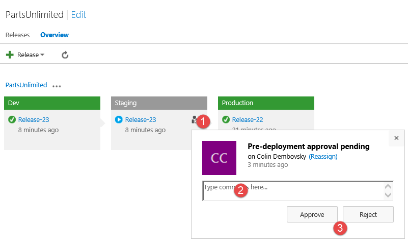


* Optionally enter a comment and click the Approve button.

	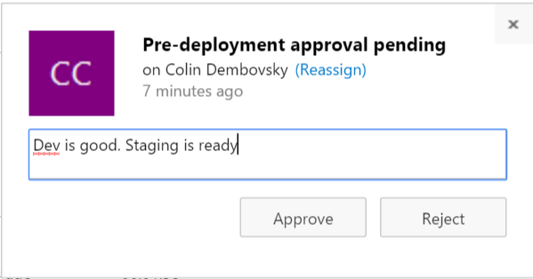

	* This will trigger the release into the Staging environment.
	> **Note**: You can reassign the approval if required.
* The deployment will immediately pause again - this time for an incoming approval to Staging.
* Approve the incoming deployment for Staging.
* Once the Staging deployment has completed, you will need to approve that
staging is OK.
* This will then trigger the pre-approval for Production. Once you've approved
that, deployment into the Production environment will begin.

> To see all your releases and where they are in their respective pipelines,
click on All Releases and then click the Overview link.

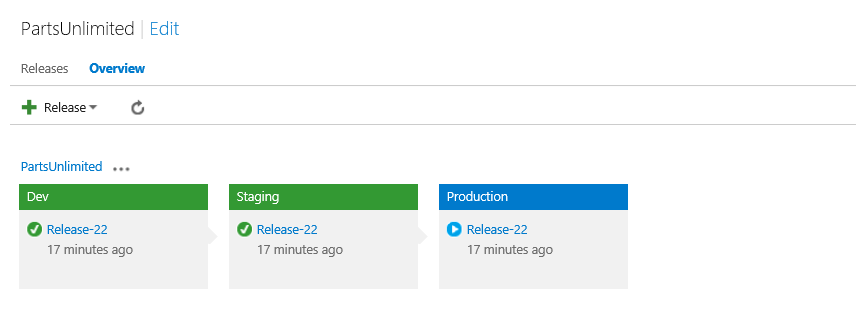

## Congratulations!
You've completed this HOL!

>**Note:** Deployment of schemas and data is beyond the scope of this HOL. It is recommended that you investigate
<a href="https://msdn.microsoft.com/en-us/library/hh272686(v=vs.103).aspx">SQL Server Data Tools (SSDT)</a> for 
managing database schema deployments.

## Further Reading
1. [Release Management for Visual Studio Team Services](https://msdn.microsoft.com/Library/vs/alm/release/overview-rmpreview)
2. [Cloud Load Testing in Visual Studio Team Services](https://channel9.msdn.com/Events/Visual-Studio/Connect-event-2015/Cloud-Loading-Testing-in-Visual-Studio-Team-Service)

The following are other PartsUnlimited Hands on Labs that you can try in your own time. **These are not required for the EdX course!**:

1. [User Telemetry with Application Insights](https://github.com/Microsoft/PartsUnlimited/blob/hands-on-labs/docs/HOL_PartsUnlimited_HDD-User-Telemetry/HOL_PartsUnlimited_HDD-User-Telemetry.md)
2. [Testing in Production with Azure Websites - PartsUnlimited](https://github.com/Microsoft/PartsUnlimited/blob/hands-on-labs/docs/HOL_HDD_Testing_in_Production/HDD%20Testing%20in%20Production%20with%20Azure%20Websites%20HOL.md)
3. [Application Performance Monitoring - PartsUnlimited](https://github.com/Microsoft/PartsUnlimited/blob/hands-on-labs/docs/HOL_PartsUnlimited_Application_Performance_Monitoring/HOL_PartsUnlimited_Application_Performance_Monitoring.md)
